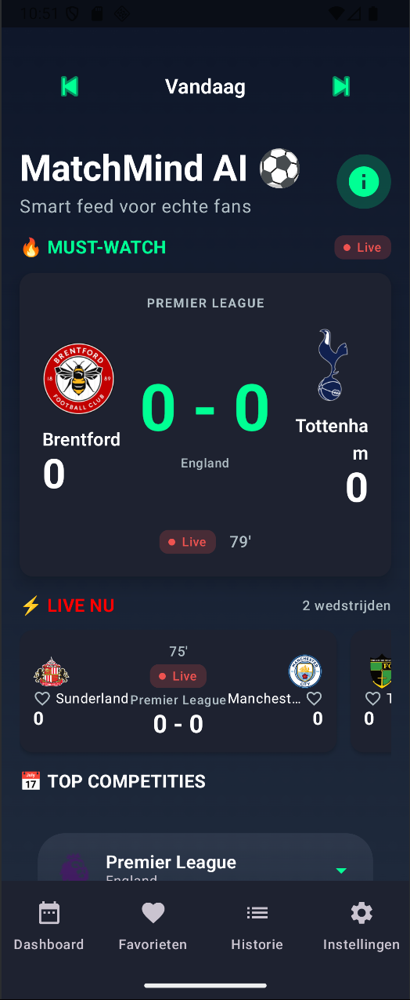
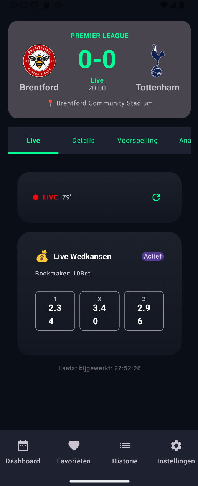
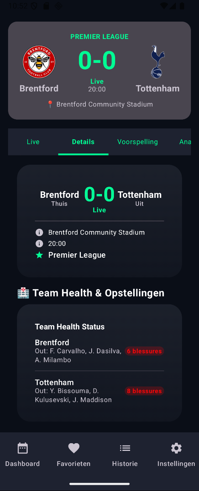
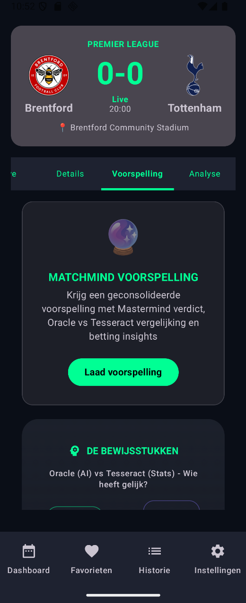
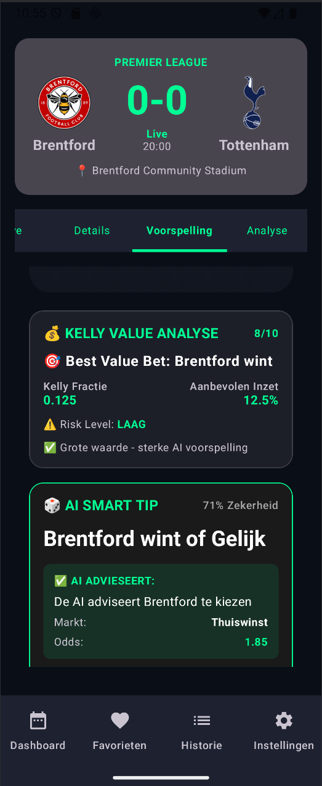

# MatchMind AI ⚽

**Slimme Voetbalvoorspellingen Aangedreven door DeepSeek AI** - Een cyber-minimalistische Android app die live voetbaldata combineert met geavanceerde AI-analyse voor accurate wedstrijdvoorspellingen en betting insights.

[](https://www.android.com)
[](https://kotlinlang.org)
[](https://developer.android.com/jetpack/compose)
[](https://blog.cleancoder.com/uncle-bob/2012/08/13/the-clean-architecture.html)
[](LICENSE)

## 📋 Inhoudsopgave
- [🎯 Overzicht](#-overzicht)
- [🚀 Kernfunctionaliteiten](#-kernfunctionaliteiten)
- [🏗️ Technische Architectuur](#️-technische-architectuur)
- [🛠️ Tech Stack](#️-tech-stack)
- [📱 Schermen & Gebruikersflow](#-schermen--gebruikersflow)
- [🔧 Installatie & Setup](#-installatie--setup)
- [🔐 API Configuratie](#-api-configuratie)
- [📊 Projectstructuur](#-projectstructuur)
- [🎨 Design Systeem](#-design-systeem)
- [🧠 AI Integratie](#-ai-integratie)
- [📈 Prestatieoptimalisatie](#-prestatieoptimalisatie)
- [🔒 Beveiliging](#-beveiliging)
- [🤝 Bijdragen](#-bijdragen)
- [📞 Support & Contact](#-support--contact)

## 🎯 Overzicht

MatchMind AI is een geavanceerde Android applicatie die voetbalwedstrijdanalyse revolutioneert door real-time sportdata te combineren met cutting-edge AI technologie. Gebouwd met Clean Architecture en moderne Android development practices, biedt het gebruikers intelligente voorspellingen, live wedstrijdtracking en beginner-vriendelijke betting insights.

### 🏆 Hoogtepunten
- **AI-Gestuurde Voorspellingen**: DeepSeek AI analyseert statistieken, teamvorm en nieuwscontext
- **Live Data Integratie**: Real-time verbinding met API-Sports voor wedstrijden, standen en odds
- **Cyber-Minimalistisch Design**: Futuristische dark-mode UI met neon groene accenten
- **Slimme Wedstrijdcuratie**: Intelligente feed prioriteert "must-watch" wedstrijden
- **Gebruikersbeheerde Beveiliging**: API keys lokaal opgeslagen met encryptie

## 🚀 Kernfunctionaliteiten

### 🤖 **AI Voorspellingsmotor**
- **DeepSeek Integratie**: Geavanceerde AI-analyse met DeepSeek's nieuwste modellen
- **Multi-Bron Analyse**: Combineert harde statistieken met zachte nieuwscontext
- **Profeet Module**: Generatieve UI systeem voor interactieve wedstrijdanalyse
- **Real-time Updates**: Live voorspellingen naarmate wedstrijdomstandigheden veranderen

### 📊 **Live Voetbaldata**
- **API-Sports Integratie**: Uitgebreide voetbaldatabase met 900+ competities
- **Real-time Wedstrijden**: Live scores, wedstrijdstatus en event tijdlijnen
- **Teamstatistieken**: Gedetailleerde team prestatiemetrics en head-to-head data
- **Blessurerapporten**: Speler beschikbaarheid en blessurestatus updates

### 🎨 **Cyber-Minimalistische UI**
- **Dark Mode First**: Geoptimaliseerd voor low-light viewing
- **Neon Groene Accenten**: Hoog contrast design voor data visualisatie
- **Glassmorfische Elementen**: Moderne UI met diepte en transparantie effecten
- **Responsive Design**: Werkt naadloos op alle Android devices

### 📱 **Slim Dashboard**
- **Gecureerde Feed**: AI-gestuurde wedstrijdprioritering op basis van excitement scores
- **Hero Wedstrijd Highlighting**: Uitgelichte wedstrijd met gedetailleerde analyse
- **Live Ticker**: Real-time updates voor lopende wedstrijden
- **Competitie Categorisatie**: Georganiseerd op competitie en belangrijkheid

### 💬 **Interactieve Chat Interface**
- **AI Conversatie**: Natuurlijke taal interactie met voetbal expert AI
- **Widget-Gebaseerde Antwoorden**: Interactieve cards voor voorspellingen, odds en wedstrijdinfo
- **Voorgestelde Acties**: Context-aware follow-up vragen
- **Sessie Management**: Persistente chat geschiedenis en context retentie

### 🎰 **Betting Analytics**
- **Beginner-Vriendelijke Odds**: Vereenvoudigde betting insights met veiligheidsratings
- **Value Bet Identificatie**: AI-gestuurde value detectie in betting markets
- **Risico Assessment**: Duidelijke risico indicatoren en kansberekeningen
- **Educatieve Content**: Leermiddelen voor betting nieuwkomers

### 🔍 **Tavily Search Integratie**
- **Real-time Web Search**: Toegang tot up-to-date nieuws, blessures, transfers en expert analyses
- **Slimme Query Routing**: Bepaalt automatisch wanneer Tavily vs. officiële APIs gebruikt worden
- **Multi-focus Search**: Ondersteunt 'news' (blessures/opstellingen), 'stats' (scores/stand), 'general' (gemengde resultaten)
- **Context-Aware Analyse**: Combineert harde API data met zachte nieuwscontext voor uitgebreide voorspellingen

## 🏗️ Technische Architectuur

MatchMind AI volgt strikte **Clean Architecture** principes met duidelijke scheiding van concerns:

```
Presentatie Laag (UI) → Domein Laag (Business Logic) → Data Laag (Network/Persistence)
```

### Laag Verantwoordelijkheden

#### **Presentatie Laag** (`presentation/`)
- **Jetpack Compose UI**: 100% declaratieve UI met Material Design 3
- **ViewModel Pattern**: State management met lifecycle awareness
- **Navigatie**: Single Activity Architecture met Compose Navigation
- **Theming**: Custom cyber-minimalistisch thema systeem

#### **Domein Laag** (`domain/`)
- **Pure Kotlin Business Logic**: Geen Android dependencies
- **Use Cases**: Single responsibility operations (GetPrediction, GetMatches, etc.)
- **Repository Interfaces**: Contract definities voor data access
- **Domein Modellen**: Core business entities (MatchFixture, Prediction, etc.)

#### **Data Laag** (`data/`)
- **Repository Implementaties**: Bridge tussen domein en data bronnen
- **Network Services**: Ktor clients voor API-Sports en DeepSeek APIs
- **Local Storage**: Room database voor caching en DataStore voor preferences
- **Mappers**: Data transformatie tussen lagen

### Belangrijke Architectuur Patronen
- **MVVM**: Model-View-ViewModel voor UI state management
- **Repository Pattern**: Abstract data access layer
- **Dependency Injection**: Manual DI met AppContainer
- **Unidirectional Data Flow**: Voorspelbare state updates

## 🛠️ Tech Stack

### **Core Platform**
- **Taal**: Kotlin 1.9+ (Modern Android Development)
- **Min SDK**: 26 (Android 8.0 - 96% device coverage)
- **Target SDK**: 34 (Android 14)
- **Build Systeem**: Gradle met Kotlin DSL

### **UI & Presentatie**
- **Jetpack Compose**: 100% declaratieve UI toolkit
- **Material Design 3**: Modern design systeem met dark mode support
- **Coil**: Image loading met SVG support en caching
- **Navigation Compose**: Type-safe navigation met deep linking

### **Networking & Data**
- **Ktor Client**: Moderne HTTP client met coroutine support
- **Kotlinx Serialization**: Type-safe JSON parsing
- **Room Database**: Lokale persistentie met SQLite
- **DataStore Preferences**: Veilige key-value storage
- **WorkManager**: Background task scheduling

### **AI & Machine Learning**
- **DeepSeek API**: Geavanceerd language model voor voetbalanalyse
- **Custom Prompt Engineering**: Domein-specifieke AI instructies
- **JSON Response Formatting**: Gestructureerde AI outputs voor UI rendering

### **Development Tools**
- **Android Studio**: Officiële IDE met Compose previews
- **Git**: Version control met conventional commits
- **Gradle BOM**: Bill of Materials voor dependency management

## 📱 Schermen & Gebruikersflow

### **Dashboard Scherm**
De centrale hub met:
- **Hero Wedstrijd Card**: Uitgelichte wedstrijd met gedetailleerde preview
- **Live Ticker**: Horizontale scroll van lopende wedstrijden
- **Competitie Secties**: Inklapbare wedstrijdlijsten per competitie
- **Slimme Prioritering**: AI-gestuurde wedstrijd ordening

### **Wedstrijd Detail Scherm**
Uitgebreide wedstrijdanalyse inclusief:
- **Team Opstellingen**: Starting XI en wisselspelers
- **Head-to-Head Stats**: Historische prestatie vergelijking
- **Voorspellings Widget**: Win kans balken en AI advies
- **Event Tijdlijn**: Minuut-voor-minuut wedstrijd events
- **Blessurerapporten**: Speler beschikbaarheid status

### **Chat Scherm**
Interactieve AI conversatie interface:
- **Message Bubbles**: Chat geschiedenis met AI antwoorden
- **Widget Antwoorden**: Interactieve voorspelling en odds cards
- **Voorgestelde Acties**: Snelle follow-up vraag knoppen
- **Profeet Module**: Geavanceerde analyse toggle

### **Settings Scherm**
Gebruikersconfiguratie en beveiliging:
- **API Key Management**: Veilige DeepSeek API key opslag
- **Thema Voorkeuren**: Dark/light mode toggle
- **Notificatie Instellingen**: Wedstrijd alert configuratie
- **Data Management**: Cache clearing en reset opties

## 🔧 Installatie & Setup

### **Vereisten**
1. **Android Studio** (Laatste stabiele versie)
2. **JDK 11** of hoger
3. **API Keys** (geconfigureerd in app Settings scherm):
   - DeepSeek API key
   - API-Sports key
   - Tavily API key (voor real-time web search functionaliteit)

### **Quick Start**
```bash
# Clone de repository
git clone https://github.com/Farmeobaasje/MatchMind.git

# Open in Android Studio
# Build en run de app
./gradlew assembleDebug

# Configureer API keys in het app Settings scherm na eerste launch
```

### **Build Configuratie**
Het project gebruikt moderne Gradle features:
- **Version Catalogs**: Gecentraliseerde dependency management in `libs.versions.toml`
- **Build Features**: Compose, BuildConfig, en viewBinding enabled
- **ProGuard Rules**: Geoptimaliseerde release builds met code shrinking

## 🔐 API Configuratie

MatchMind AI gebruikt **gebruikersbeheerde beveiliging** met **GEEN hardcoded credentials**:

1. **DeepSeek API**: Voer je key in het app Settings scherm in (Settings → API Configuration)
2. **API-Sports**: Ook geconfigureerd in het app Settings scherm
3. **Tavily API**: Configureer je Tavily API key voor real-time web search functionaliteit
4. **Lokale Encryptie**: Alle keys veilig opgeslagen met Android Keystore encryptie
5. **Dynamische Retrieval**: Keys worden opgehaald uit veilige opslag tijdens runtime
6. **Graceful Handling**: App handelt `MissingApiKeyException` af door te redirecten naar settings
7. **Slimme Tool Routing**: AI bepaalt automatisch wanneer Tavily (nieuws/blessures) vs. officiële APIs (stats/wedstrijden) gebruikt worden

## 📊 Projectstructuur

```
MatchMindAI/
├── app/
│   ├── src/main/
│   │   ├── java/com/Lyno/matchmindai/
│   │   │   ├── data/           # Data layer implementaties
│   │   │   │   ├── ai/         # AI integratie en prompts
│   │   │   │   ├── dto/        # Data transfer objects
│   │   │   │   ├── local/      # Database en storage
│   │   │   │   ├── mapper/     # Data transformatie
│   │   │   │   ├── remote/     # Network clients
│   │   │   │   └── repository/ # Repository implementaties
│   │   │   ├── domain/         # Business logic layer
│   │   │   │   ├── model/      # Domein entities
│   │   │   │   ├── repository/ # Repository interfaces
│   │   │   │   ├── service/    # Domein services
│   │   │   │   └── usecase/    # Business use cases
│   │   │   └── presentation/   # UI layer
│   │   │       ├── components/ # Herbruikbare UI components
│   │   │       ├── screens/    # Feature schermen
│   │   │       ├── viewmodel/  # ViewModels
│   │   │       └── widgets/    # Android widgets
│   │   └── res/                # Resources
│   │       ├── drawable/       # Vector assets
│   │       ├── layout/         # XML layouts (widgets)
│   │       ├── values/         # Colors, strings, themes
│   │       └── xml/            # Configuratie files
├── gradle/                     # Gradle configuratie
└── build.gradle.kts           # Root build configuratie
```

## 🎨 Design Systeem

### **Kleurpalet**
- **Achtergrond**: `#0F1115` (Diep space zwart met blauwe ondertonen)
- **Oppervlak**: `#1E222A` (Verhoogde card achtergronden)
- **Primair**: `#00E676` (Neon groen voor acties en highlights)
- **Secundair**: `#2979FF` (Cyber blauw voor informatie)
- **Tekst Primair**: `#FFFFFF` (Pure wit voor headers)
- **Tekst Secundair**: `#B0BEC5` (Licht grijs voor body tekst)

### **Typografie**
- **Headlines**: Inter Bold/Black voor impact
- **Data Display**: JetBrains Mono voor technische informatie
- **Body Text**: Inter Regular met 1.5 line height
- **Labels**: Inter Medium met tracking

### **Componenten**
- **Glass Cards**: Frosted achtergrond met blur effecten
- **Status Badges**: Kleur-gecodeerde wedstrijd status indicatoren
- **Progress Bars**: Geanimeerde kans visualisaties
- **Input Fields**: Cyber-style text inputs met glow effecten

## 🧠 AI Integratie

### **DeepSeek Configuratie**
- **Model**: `deepseek-chat` (Laatste versie)
- **Temperature**: 0.5 (Gebalanceerde creativiteit en consistentie)
- **Response Format**: `{"type": "json_object"}` voor gestructureerde outputs
- **System Prompts**: Voetbal domein expertise instructies

### **Prompt Engineering**
- **Anchor & Adjust Strategie**:
  - **Anchor**: Harde feiten van API-Sports statistieken
  - **Adjust**: Nieuws context en recente ontwikkelingen
  - **Analyse**: Conflict identificatie tussen stats en nieuws
  - **Risico Factor**: "Killer scenario" identificatie

### **Response Types**
- **Tekst Response**: Standaard chat bubble met analyse
- **Voorspellings Widget**: Interactieve win kans visualisatie
- **Wedstrijd Widget**: Ingebedde wedstrijd card met live data
- **Odds Widget**: Betting insights met value ratings

## 📈 Prestatieoptimalisatie

### **Caching Strategie**
- **Room Database**: Lokale cache met TTL (Time To Live)
- **Memory Cache**: In-memory store voor frequente access
- **Network Cache**: HTTP cache headers utilizatie
- **Match Cache Manager**: Intelligente cache invalidatie op basis van wedstrijdstatus

### **Image Loading**
- **Coil Integration**: Asynchrone image loading met memory caching
- **SVG Support**: Vector graphics voor scherpe iconen op alle resoluties
- **Placeholder System**: Loading states tijdens data fetch

### **Network Optimalisatie**
- **Connection Pooling**: Hergebruik van HTTP connections
- **Request Batching**: Gecombineerde API calls waar mogelijk
- **Retry Logic**: Exponential backoff voor failed requests
- **Offline Support**: Graceful degradation bij netwerkverlies

## 🔒 Beveiliging

### **API Key Management**
- **Geen Hardcoded Credentials**: Alle API keys worden door de gebruiker ingevoerd
- **Android Keystore Encryptie**: Veilige opslag van gevoelige data
- **Runtime Key Retrieval**: Keys worden dynamisch opgehaald tijdens gebruik
- **MissingApiKeyException**: Graceful handling met redirect naar settings

### **Data Privacy**
- **Lokale Opslag**: Alle gebruikersdata blijft op het device
- **Geen Tracking**: Geen analytics of gebruikersgedrag tracking
- **Transparante Permissies**: Minimale permissies met duidelijke uitleg
- **Data Clearing**: Volledige data verwijdering optie in settings

### **Network Security**
- **HTTPS Only**: Alle API calls via beveiligde verbindingen
- **Certificate Pinning**: Extra beveiliging voor kritieke endpoints
- **Input Sanitization**: Preventie van injection attacks
- **Rate Limiting**: Bescherming tegen API abuse

## 🤝 Bijdragen

### **Development Workflow**
1. **Fork de repository**
2. **Maak een feature branch** (`git checkout -b feature/amazing-feature`)
3. **Commit je wijzigingen** (`git commit -m 'Add some amazing feature'`)
4. **Push naar de branch** (`git push origin feature/amazing-feature`)
5. **Open een Pull Request**

### **Code Guidelines**
- **Kotlin Coding Conventions**: Volg officiële Kotlin style guide
- **Clean Architecture**: Behoud de laag scheiding
- **Compose Best Practices**: Gebruik recomposition-optimized patterns
- **Test Coverage**: Schrijf unit tests voor nieuwe functionaliteit

### **Pull Request Process**
- **Beschrijving**: Duidelijke uitleg van wijzigingen en motivatie
- **Screenshots**: Visuals voor UI wijzigingen
- **Tests**: Bevestiging dat bestaande tests nog werken
- **Review**: Minimaal één review vereist voor merge

## 📸 Screenshots

<div align="center">
  
  
  
  <br/>
  
  
  
</div>

## 📞 Support & Contact

### **Documentatie**
- **GitHub Repository**: [https://github.com/Farmeobaasje/MatchMind](https://github.com/Farmeobaasje/MatchMind)
- **Issue Tracker**: Gebruik GitHub Issues voor bug reports en feature requests
- **Wiki**: Technische documentatie en architecture guides

### **Contact Informatie**
- **Developer**: Lyno Development Team
- **Email**: [Contact via GitHub Issues]
- **Discord**: [Community server link binnenkort beschikbaar]

### **License**
Dit project is **Proprietary Software**. Alle rechten voorbehouden. Het is niet toegestaan om deze software te kopiëren, wijzigen, verspreiden of commercieel te gebruiken zonder expliciete toestemming van de auteur.

© 2025 Lyno Development. Alle rechten voorbehouden.
