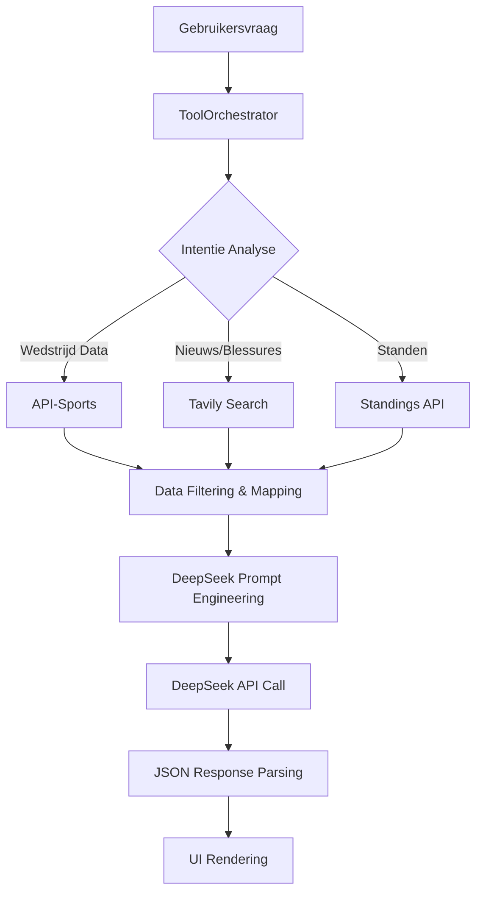

# DeepSeek Data Processing & API Integration

## 📊 **Overzicht van de AI Data Flow**

MatchMind AI gebruikt een geavanceerde hybride architectuur waarbij DeepSeek AI wordt gecombineerd met externe data bronnen voor sportvoorspellingen. Dit document beschrijft hoe data wordt verwerkt, getransformeerd en geanalyseerd.



## 🤖 **DeepSeek AI Integration**

### **API Configuratie**
```kotlin
// Basis DeepSeek API configuratie
val client = HttpClient(CIO) {
    install(ContentNegotiation) {
        json(Json {
            ignoreUnknownKeys = true
            isLenient = true
        })
    }
    defaultRequest {
        url("https://api.deepseek.com/chat/completions")
        header("Authorization", "Bearer $apiKey")
        contentType(ContentType.Application.Json)
    }
}
```

### **Request Structuur**
```json
{
  "model": "deepseek-chat",
  "messages": [
    {
      "role": "system",
      "content": "Jij bent MatchMind, een elite sport data-analist..."
    },
    {
      "role": "user", 
      "content": "Analyseer Ajax vs Feyenoord"
    }
  ],
  "temperature": 0.5,
  "max_tokens": 1000,
  "response_format": { "type": "json_object" },
  "tools": [...],
  "tool_choice": "auto"
}
```

## 🔧 **Tool-Based Data Acquisition**

### **1. API-Sports Data Integration**
```kotlin
// FootballApiService.kt
interface FootballApiService {
    @GET("fixtures")
    suspend fun getFixtures(
        @Query("date") date: String,
        @Query("timezone") timezone: String,
        @Header("x-apisports-key") apiSportsKey: String
    ): FixtureResponseDto
    
    @GET("fixtures")
    suspend fun getFixturesByTeamAndDateRange(
        @Query("team") teamId: Int,
        @Query("from") fromDate: String,
        @Query("to") toDate: String,
        @Query("timezone") timezone: String,
        @Header("x-apisports-key") apiSportsKey: String
    ): FixtureResponseDto
}
```

### **2. Tavily Search Integration**
```kotlin
// SearchService.kt
interface SearchService {
    @POST("search")
    suspend fun search(
        @Body request: TavilyRequest
    ): TavilyResponse
}

data class TavilyRequest(
    val query: String,
    val search_depth: String = "basic",
    val include_answer: Boolean = false,
    val include_raw_content: Boolean = false,
    val max_results: Int = 5
)
```

### **3. Tool Definitions in Tools.kt**
```kotlin
val tools = listOf(
    Tool(
        type = "function",
        function = Function(
            name = "get_fixtures",
            description = "Get football fixtures for a specific date or team",
            parameters = JsonObject(
                mapOf(
                    "type" to JsonPrimitive("object"),
                    "properties" to JsonObject(
                        mapOf(
                            "date" to JsonObject(
                                mapOf(
                                    "type" to JsonPrimitive("string"),
                                    "description" to JsonPrimitive("Date in YYYY-MM-DD format")
                                )
                            ),
                            "search_query" to JsonObject(
                                mapOf(
                                    "type" to JsonPrimitive("string"),
                                    "description" to JsonPrimitive("Team name to search for (e.g., 'Ajax')")
                                )
                            )
                        )
                    )
                )
            )
        )
    )
)
```

## 🧠 **Prompt Engineering Strategy**

### **System Prompt Template**
```
Jij bent MatchMind, een elite sport data-analist. Je bent koud, berekenend en baseert je op statistiek.

DATUM VANDAAG: ${currentDate}

REGELS:
1. Je bent een autonome sportanalist.
2. Als je actuele informatie mist, GEBRUIK dan je tools.
3. GOK NIET - als je niet zeker bent, zoek het op.
4. Focus op recente data (laatste paar weken/maanden).
5. Taal: NEDERLANDS.
6. Format: JSON.

STRATEGIE VOOR TRUSTED SOURCES:
- Voor statistieken en uitslagen: gebruik get_fixtures tool.
- Voor blessures en nieuws: gebruik search_internet tool met focus='news'.
- Voor algemene informatie: gebruik search_internet tool met focus='general'.

OUTPUT FORMAT (JSON):
{
  "winner": "Team Naam",
  "confidence_score": 0-100,
  "risk_level": "LOW/MEDIUM/HIGH",
  "reasoning": "Korte analyse (max 3 zinnen).",
  "key_factor": "Eén kernzin (max 5 woorden).",
  "sources": ["url1", "url2"],
  "suggested_actions": ["Voorspel Ajax vs Feyenoord", "Check PSV vorm"]
}
```

### **Context Injection**
```kotlin
// MatchRepositoryImpl.kt - Context building
private fun buildEnrichedPrompt(
    homeTeam: String, 
    awayTeam: String,
    scrapedContext: String
): String {
    return """
        Analyseer de wedstrijd $homeTeam vs $awayTeam.
        
        LIVE CONTEXT VAN INTERNET:
        $scrapedContext
        
        INSTRUCTIES:
        1. Scan de bovenstaande tekst voor blessures, vorm, recent nieuws.
        2. Gebruik SPECIFIEKE feiten uit deze tekst in je 'reasoning'.
        3. Wees een journalist, geen robot.
        4. Als de tekst onzin is, negeer het dan.
        
        OUTPUT FORMAT: JSON zoals hierboven gedefinieerd.
    """.trimIndent()
}
```

## 🔄 **Data Processing Pipeline**

### **Stap 1: Intentie Detectie**
```kotlin
// ToolOrchestrator.kt - Intent analysis
private suspend fun determineIntent(query: String): AnalysisIntent {
    return when {
        query.contains("wanneer", ignoreCase = true) -> AnalysisIntent.SCHEDULE
        query.contains("blessure", ignoreCase = true) -> AnalysisIntent.INJURIES
        query.contains("stand", ignoreCase = true) -> AnalysisIntent.STANDINGS
        else -> AnalysisIntent.PREDICTION
    }
}
```

### **Stap 2: Data Acquisition**
```kotlin
// Parallel data fetching
val fixturesDeferred = async { footballApi.getFixtures(date, timezone, apiKey) }
val searchDeferred = async { tavilyApi.search(TavilyRequest("$homeTeam $awayTeam news injuries")) }
val standingsDeferred = async { footballApi.getStandings(leagueId, season, apiKey) }

val results = awaitAll(fixturesDeferred, searchDeferred, standingsDeferred)
```

### **Stap 3: Data Filtering & Transformation**
```kotlin
// "Kotlin Douane" filtering voor team-specifieke queries
fun filterFixturesByTeam(fixtures: List<FixtureItemDto>, teamQuery: String): List<FixtureItemDto> {
    return if (teamQuery.isNotBlank()) {
        fixtures.filter { fixture ->
            fixture.teams.home.name.contains(teamQuery, ignoreCase = true) ||
            fixture.teams.away.name.contains(teamQuery, ignoreCase = true) ||
            teamQuery.contains(fixture.teams.home.name, ignoreCase = true) ||
            teamQuery.contains(fixture.teams.away.name, ignoreCase = true)
        }.take(50) // Limit to prevent token overflow
    } else {
        fixtures.filterTopLeagues().take(20) // Top leagues only for general queries
    }
}
```

### **Stap 4: Prompt Assembly**
```kotlin
// Dynamic prompt building based on available data
val prompt = buildString {
    appendLine("Analyseer $homeTeam vs $awayTeam")
    
    if (fixtures.isNotEmpty()) {
        appendLine("\nRECENTE WEDSTRIJDEN:")
        fixtures.take(5).forEach { fixture ->
            appendLine("- ${fixture.teams.home.name} vs ${fixture.teams.away.name} (${fixture.goals.home}-${fixture.goals.away})")
        }
    }
    
    if (searchResults.isNotEmpty()) {
        appendLine("\nNIEUWS & BLESSURES:")
        searchResults.take(3).forEach { result ->
            appendLine("- ${result.title}: ${result.snippet.take(100)}...")
        }
    }
    
    appendLine("\nGeef je analyse in JSON formaat.")
}
```

### **Stap 5: AI Response Parsing**
```kotlin
// Safe JSON parsing with error handling
fun parseDeepSeekResponse(jsonString: String): Result<MatchPrediction> {
    return try {
        // Clean JSON (remove markdown code blocks)
        val cleanJson = jsonString
            .replace("```json", "")
            .replace("```", "")
            .trim()
        
        val predictionDto = Json.decodeFromString<DeepSeekResponse>(cleanJson)
        val prediction = matchMapper.mapToDomain(predictionDto)
        
        Result.success(prediction)
    } catch (e: SerializationException) {
        Result.failure(e)
    }
}
```

## 📈 **Response Types & UI Rendering**

### **Polymorphic Response Handling**
```kotlin
// AgentResponse.kt - Flexible response types
sealed class AgentResponse {
    data class TextResponse(val text: String) : AgentResponse()
    data class PredictionResponse(val prediction: MatchPrediction) : AgentResponse()
    data class FixturesWidget(val matches: List<MatchFixture>, val summary: String) : AgentResponse()
    data class NewsWidget(val newsItems: List<NewsItemData>, val summary: String) : AgentResponse()
}
```

### **UI Rendering Pipeline**
```kotlin
// ChatScreen.kt - Response rendering
@Composable
fun ChatMessageItem(message: ChatMessage) {
    when (val response = message.response) {
        is AgentResponse.TextResponse -> {
            TextBubble(text = response.text)
        }
        is AgentResponse.PredictionResponse -> {
            PredictionCard(prediction = response.prediction)
        }
        is AgentResponse.FixturesWidget -> {
            FixturesWidget(
                matches = response.matches,
                summary = response.summary
            )
        }
        is AgentResponse.NewsWidget -> {
            NewsWidget(
                newsItems = response.newsItems,
                summary = response.summary
            )
        }
    }
}
```

## 🧠 **Context Retention & Memory**

### **Sliding Window Context**
```kotlin
// ChatRepositoryImpl.kt - Context management
override suspend fun getContextMessages(sessionId: String): List<ChatMessageEntity> {
    return chatDao.getContextMessages(sessionId, CONTEXT_LIMIT)
}

// Tool output storage as hidden messages
override suspend fun saveToolOutput(sessionId: String, toolName: String, result: String) {
    val entity = ChatMessageEntity(
        sessionId = sessionId,
        content = "Tool: $toolName\nResult: $result",
        role = "tool",
        timestamp = System.currentTimeMillis(),
        isHidden = true,
        type = "TOOL_OUTPUT"
    )
    chatDao.insertMessage(entity)
}
```

### **Session-Based Context**
```kotlin
// MatchRepositoryImpl.kt - Session context injection
private suspend fun injectChatHistory(sessionId: String): List<ChatMessage> {
    return chatRepository.getContextMessages(sessionId)
        .map { entity ->
            ChatMessage(
                content = entity.content,
                role = when (entity.role) {
                    "user" -> ChatRole.USER
                    "assistant" -> ChatRole.ASSISTANT
                    else -> ChatRole.TOOL
                }
            )
        }
}
```

## ⚡ **Performance Optimizations**

### **1. Caching Strategy**
```kotlin
// Fixture caching with 30-minute TTL
private suspend fun getCachedFixtures(date: String): List<FixtureItemDto>? {
    val cached = fixtureDao.getFixturesByDate(date)
    val now = System.currentTimeMillis()
    
    return if (cached.isNotEmpty() && (now - cached.first().timestamp) < 30 * 60 * 1000) {
        cached.map { it.toDto() }
    } else {
        null
    }
}
```

### **2. Parallel Execution**
```kotlin
// Concurrent data fetching
suspend fun getMatchAnalysisContext(fixtureId: Int): MatchContext {
    val detailsDeferred = async { getFixtureDetails(fixtureId) }
    val predictionsDeferred = async { getPredictions(fixtureId) }
    val injuriesDeferred = async { getInjuries(fixtureId) }
    
    return MatchContext(
        details = detailsDeferred.await(),
        predictions = predictionsDeferred.await(),
        injuries = injuriesDeferred.await()
    )
}
```

### **3. Token Management**
```kotlin
// Limit response size to prevent token overflow
private fun limitResponseSize(response: String, maxTokens: Int = 8000): String {
    val words = response.split(" ")
    return if (words.size > maxTokens) {
        words.take(maxTokens).joinToString(" ") + "..."
    } else {
        response
    }
}
```

## 🐛 **Error Handling & Robustness**

### **Graceful Degradation**
```kotlin
// Fallback mechanisms for API failures
suspend fun getTodaysMatches(): Result<List<MatchFixture>> {
    return try {
        // Try API-Sports first
        val apiResult = footballApiService.getFixtures(today, timezone, apiKey)
        Result.success(apiResult.toDomain())
    } catch (e: Exception) {
        // Fallback to Tavily search
        val searchResult = tavilyApi.search(TavilyRequest("football matches today"))
        Result.success(parseSearchResults(searchResult))
    }
}
```

### **JSON Parsing Safety**
```kotlin
// Safe JSON parsing with fallback
fun String.cleanJson(): String {
    return this
        .replace("```json", "")
        .replace("```", "")
        .replace("\n", " ")
        .trim()
}

// Parse with multiple attempts
fun parseJsonWithFallback(jsonString: String): JsonElement {
    return try {
        Json.parseToJsonElement(jsonString.cleanJson())
    } catch (e: Exception) {
        // Try alternative parsing
        Json.parseToJsonElement("{\"error\": \"Failed to parse JSON\"}")
    }
}
```

## 📊 **Monitoring & Logging**

### **Tool Execution Logging**
```kotlin
// Log tool usage for debugging
private suspend fun executeTool(toolCall: ToolCall): ToolResult {
    val startTime = System.currentTimeMillis()
    
    val result = when (toolCall.function.name) {
        "get_fixtures" -> executeGetFixtures(toolCall)
        "search_internet" -> executeTavilySearch(toolCall)
        "get_standings" -> executeGetStandings(toolCall)
        else -> createToolError("Unknown tool: ${toolCall.function.name}")
    }
    
    val duration = System.currentTimeMillis() - startTime
    Log.d("ToolOrchestrator", "Tool ${toolCall.function.name} executed in ${duration}ms")
    
    return result
}
```

### **AI Response Quality Metrics**
```kotlin
// Track response quality
data class ResponseMetrics(
    val responseTime: Long,
    val tokenCount: Int,
    val hasSources: Boolean,
    val confidenceScore: Int,
    val errorType: String? = null
)

fun trackResponseMetrics(prediction: MatchPrediction, startTime: Long) {
    val metrics = ResponseMetrics(
        responseTime = System.currentTimeMillis() - startTime,
        tokenCount = prediction.reasoning.length / 4, // Rough estimate
        hasSources = prediction.sources.isNotEmpty(),
        confidenceScore = prediction.confidenceScore
    )
    
    // Log or send to analytics
    Log.d("Analytics", "Response metrics: $metrics")
}
```

## 🚀 **Best Practices & Lessons Learned**

### **1. Tool Design Principles**
- **Specific Tools**: Elke tool heeft een duidelijk gedefinieerd doel
- **Parameter Validation**: Valideer input parameters voordat API calls worden gedaan
- **Rate Limiting**: Implementeer rate limiting voor externe APIs
- **Error Messages**: Geef duidelijke error messages voor debugging

### **2. Prompt Engineering Tips**
- **Context Injection**: Injecteer specifieke data in prompts voor betere resultaten
- **Output Formatting**: Forceer JSON output voor consistente parsing
- **Language Control**: Specificeer taal in system prompt
- **Temperature Settings**: Gebruik lage temperature (0.5) voor consistente resultaten

### **3. Performance Considerations**
- **Parallel Execution**: Fetch data parallel waar mogelijk
- **Caching**: Cache API responses met TTL
- **Token Management**: Beperk response grootte om kosten te controleren
- **Lazy Loading**: Laad data alleen wanneer nodig

### **4. User Experience**
- **Loading States**: Toon loading indicators tijdens AI "denken"
- **Error Recovery**: Bied retry opties bij failures
- **Progressive Disclosure**: Toon eerst samenvatting, dan details
- **Suggestions**: Gebruik suggested actions voor betere UX

## 🔮 **Toekomstige Verbeteringen**

### **1. Advanced AI Features**
- **Multi-Modal Analysis**: Combineer statistieken met visuele data (heatmaps, pass networks)
- **Predictive Modeling**: Machine learning modellen voor accuratere voorspellingen
- **Real-time Adaptation**: AI die zich aanpast aan live wedstrijdverloop
- **Cross-Sport Analysis**: Uitbreiding naar andere sporten (basketbal, tennis, etc.)

### **2. Technical Improvements**
- **Streaming Responses**: Real-time token streaming voor betere UX
- **Batch Processing**: Parallelle verwerking van meerdere wedstrijden
- **Offline Mode**: Lokale AI modellen voor offline gebruik
- **Edge Computing**: On-device processing voor lagere latency

### **3. User Experience Enhancements**
- **Personalized Insights**: AI die leert van gebruiker voorkeuren
- **Social Features**: Delen en vergelijken van voorspellingen
- **Gamification**: Achievement system voor accurate voorspellingen
- **Community Analysis**: Vergelijk je voorspellingen met andere gebruikers

## 📚 **Conclusie**

MatchMind AI's data processing pipeline vertegenwoordigt een geavanceerde integratie van moderne AI technologieën met sport data analytics. Door het combineren van:

1. **Tool-Based Architecture**: Flexibele data acquisitie via gespecialiseerde tools
2. **Context-Aware AI**: DeepSeek met sliding window memory voor consistente conversaties
3. **Hybride Data Sources**: API-Sports voor gestructureerde data + Tavily voor unstructured web data
4. **Robuuste Error Handling**: Graceful degradation bij API failures
5. **Performance Optimizations**: Caching, parallel execution, token management

De applicatie biedt gebruikers een premium sport analyse ervaring die zowel diepgaande inzichten als gebruiksvriendelijkheid combineert. De architectuur is ontworpen voor schaalbaarheid, onderhoudbaarheid en toekomstige uitbreidingen.

---

**Laatst bijgewerkt**: ${currentDate}  
**Auteur**: MatchMind AI Development Team  
**Versie**: 1.0.0
